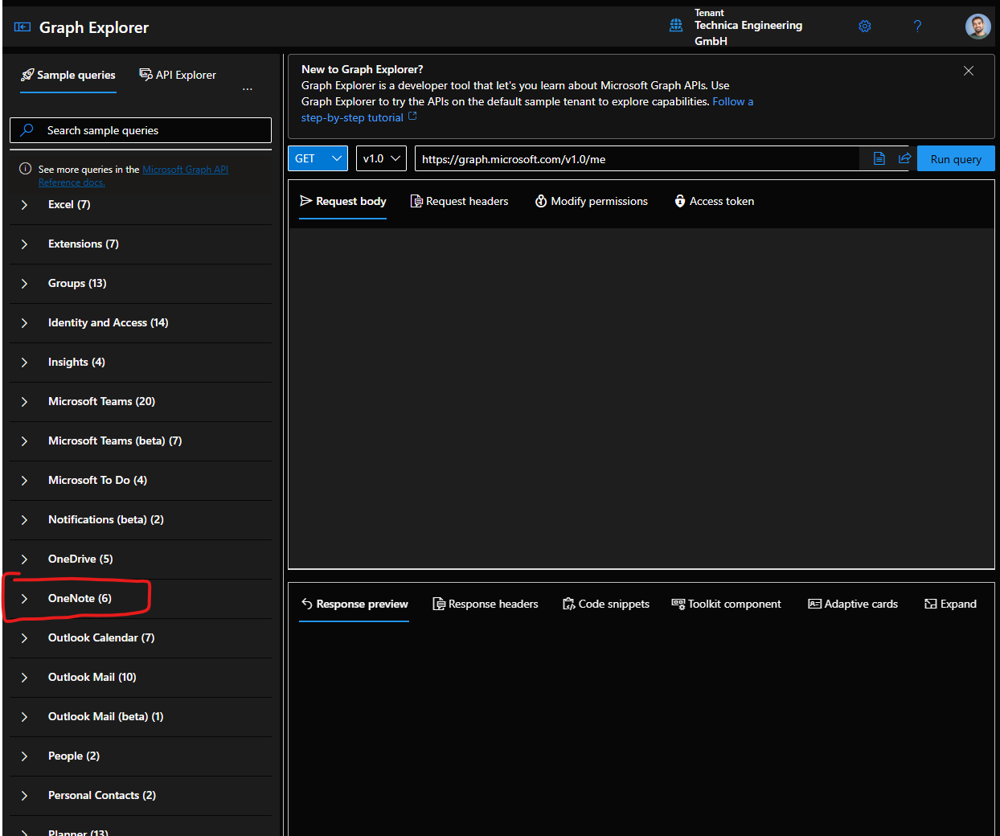
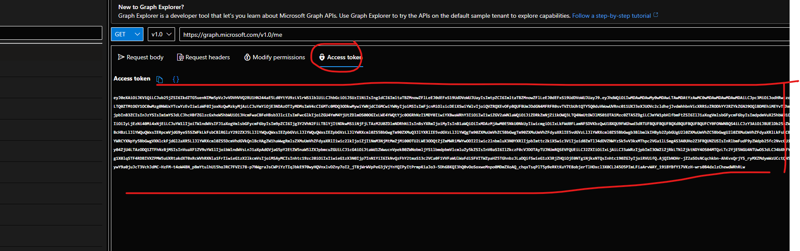
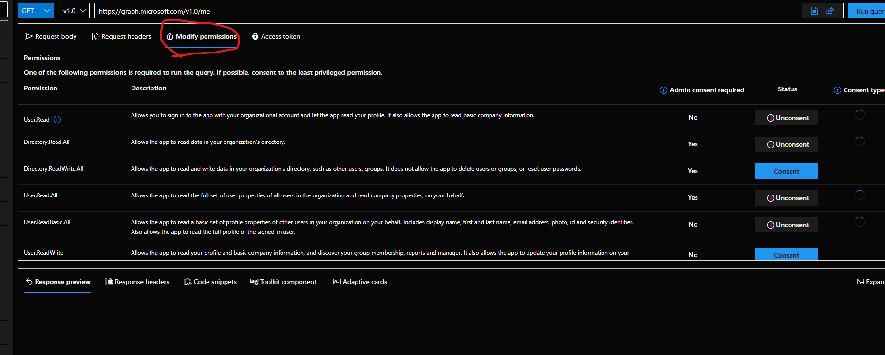
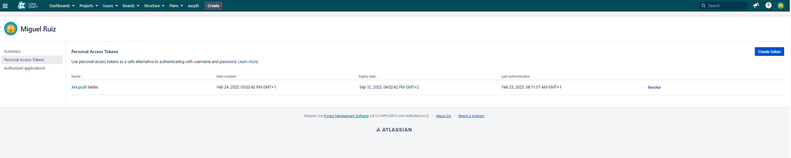
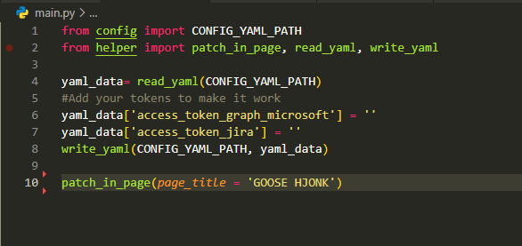

# JIRA-ONENOTE UPDATER


## Introduction
This projects help you to create a table in your OneNote page with all the most important info about the current Sprint of your Jira project. This table has info like: the **owner** of the ticket, the **hyperlink** to that ticket, its **description**, the **priority level** that it has and the **current ticket status**.
This simple project use two APIs: It first use the Jira API to gather all needed information about the desired sprint from a query. The Sprint id is storaged in *config.py* and can be modified according to the user Sprint that is currently performing. About the query, it is created according to my profile information but can be adapted according to what the user needs to extract from Jira. Eventually this data will be adapted to a chart where there will be alligned the tickets with the owners and the rest of info. (**REMARK**: as I said, the query only collect **that information that I described**. In case you want to get other parameters you will not only have to update the query, but the table struct according to which do you want to display in the chart and how)
In the other hand, the second necessary API is the one from Graph Microsoft tool. This API provides you with a variety of queries to manipulate OneNote information. In my case I use it to **PATCH** the previous table to a specific OneNote page.

## Instructions
### Preconditions
+ Open the [Graph Microsoft](https://developer.microsoft.com/en-us/graph/graph-explorer) website and log with yout Technica Engineering account.
+ When you have logged, go to **OneNote** section:

+ Once in that section, you will have to do two things:
  + First, go to **Acess token** section and copy the token:

  + This step is optional, but maybe you will have to go to **Modify permissions** section and consent some of them to allow the API gather some info of your notebook:

+ Next, you will have to go to your Jira profile and generate and copy as well an access token:


### Execution
The previous steps are mandatory to make the code executes. Now the next steps will guide you to execute the code to produce de Sprint table in your Onenote page:
+ Git clone repo with SSH .
+ Execute in terminal the next command to install all needed requirements for the project: 
  ```bash
    pip install -r requirements.txt
+ Go to **main.py** file and you will have to do three things before you execute it:
  + The *Graph Microsoft access token* and *Jira access token* will have to be added inside the .yaml file.
  + In line 3 you will see the method that will execute everything. You will just have to set in the argument **page_title** the name of the Onenote page you want to use. It does not matter the section that the page belongs. The query will search it among all the pages of every section.

  + In case you like the struct of the chart that the methods create by default, you will just have to go to **helper.py** and in line-55 you will just have to add your jira profile username in the **assigne** part.
    + As I said at the beginning, in case you do not like the information that the query collects, you just have to put the query you desire, but will have to modify as well the mehods **create_onenote_table** and **add_issues_to_table** to organize the data as you want.
  + You have to modify the **Sprint number** in the *config.py* file.
  + Eventually, if you execute it, all should go as expected and you should have your Sprint table updated to your OneNote page :)

Having said all these things, I hope it results helpful :v
Any question please do not hesitate to contact me :)

## Additional information
The method that i use to add the table on OneNote is ****PATCH****. This method overwrites content in the page, what means that if there was anything before the table it will not be deleted. To clear the content of the page everytime that I execute the code to avoid having tables over tables is to call at the beginning a patching method that cleans the previous existing content in the page and then it add the updated Sprint table.
****¡¡FRIENDLY REMINDER!!**** Graph Microsoft Access tokens do not last too much so probably if you use it today f.e. you will have to generate a new one tomorrow.
